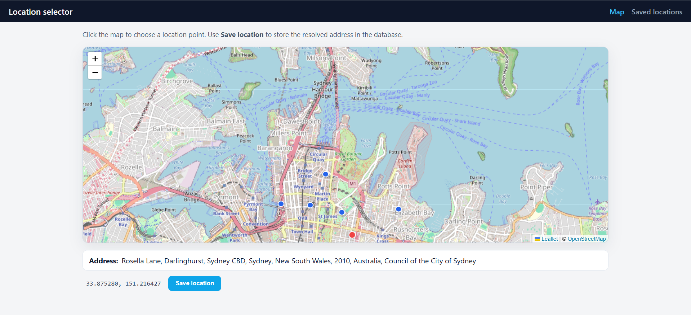
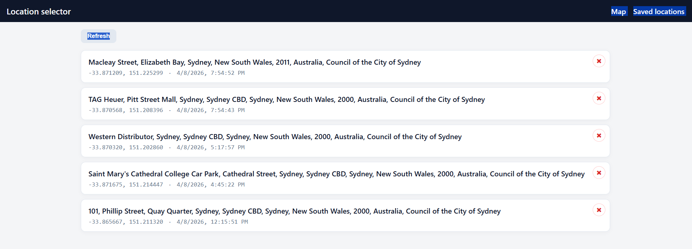

# Location selector (Vue + Vuex + Node, TypeScript)





Same features as the JavaScript sample: map picker (Sydney CBD default), SQLite persistence, and a history view—with a **TypeScript** frontend and backend, plus **shared API types** used by both.

- **Frontend:** Vue 3, Vuex 4, Vue Router, Vite, Leaflet, TypeScript (`vue-tsc`)  
- **Backend:** Express (MVC-style layout), TypeScript (`tsc` + `tsx` for dev), `better-sqlite3`, Nominatim reverse geocoding  
- **Shared:** `shared/location.ts` — `LocationRow`, `CreateLocationBody`, `HealthResponse` (imported as `@shared/location` in the client)

## Prerequisites

- **Node.js** 18+
- **npm**

## Install

From this directory (`samp-locatiom-selector-vue-ts`):

```bash
npm install
npm run install:all
```

This repo includes a root `.npmrc` that turns off the progress bar and skips audit/fund prompts so installs are quieter in terminals where npm’s UI looks “stuck” or repeats `idealTree` / timing lines.


## Run (development)

```bash
npm run dev
```

- **Web UI:** [http://localhost:5174](http://localhost:5174)  
- **API:** [http://localhost:3002](http://localhost:3002) (Vite proxies `/api` here)

Ports **5174** / **3002** avoid clashing with the JS sample app (5173 / 3001) if you run both machines side by side.

**Terminal A — API only** (from `server/`):

```bash
cd server && npm run dev
```

Uses `tsx watch` to run `src/app.ts` with reload on changes.

**Terminal B — client only** (from `client/`):

```bash
cd client && npm run dev
```

## Using the app

1. **Map** — Click the map to move the marker; press **Save location** to store the point. The server resolves the address via Nominatim when you do not send `address` in the JSON body.
2. **Past locations** — Lists every row from the database with address, coordinates, and time. **Refresh** reloads from the API.

The database file is `server/data/locations.db` (created automatically).

## Production build

Builds the server (TypeScript → JavaScript) and the client:

```bash
npm run build
npm start
```

- **Server output:** `server/dist/` (entry: `dist/server/src/app.js` relative to the `server` package).  
- **Start** runs `npm run start --prefix server`, which executes Node with the compiled app. Run this from the repo root so documented paths behave as expected, or always start the server with `cwd` set to `server/` (as npm does when using `--prefix server`).

After `npm run build`, the API can also serve the built SPA from `client/dist` when that folder exists.

## Typechecking (server)

From `server/`:

```bash
npm run typecheck
```

Runs `tsc` with `--noEmit` to verify types without writing files.

## Environment variables

| Variable | Where | Description |
|----------|--------|-------------|
| `PORT` | Server | API port (default **3002**). |
| `CORS_ORIGIN` | Server | CORS origin(s). |
| `NOMINATIM_USER_AGENT` | Server | Required by Nominatim usage policy; identifies your deployment. |
| `NODE_ENV` | Server | Non-`production` may include stack traces in JSON errors. |

Optional `server/.env` is supported via `dotenv`.

## API (quick reference)

| Method | Path | Description |
|--------|------|-------------|
| GET | `/api/health` | `{ "ok": true }` |
| GET | `/api/locations` | Array of `LocationRow` |
| POST | `/api/locations` | Body: `CreateLocationBody` — `{ latitude, longitude, address? }` |

Shared shapes live in `shared/location.ts` so the client and server stay aligned.

## Project layout

- `client/` — Vite + Vue + TypeScript SPA  
- `server/` — Express TypeScript (`tsconfig.json` compiles `server/src` and `shared/`)  
- `shared/` — Cross-cutting types for HTTP contracts (no runtime logic)  
- `server/data/` — SQLite `locations.db` (gitignored when configured)

## Folder name

This sample uses the folder name **`samp-locatiom-selector-vue-ts`** (typo in “location”) to match the path you chose in the repo.

## Troubleshooting

### Windows install errors (SQLite / `better-sqlite3`)

`better-sqlite3` is a native addon. If `npm install` under `server/` fails on Windows:

- Install [Build Tools for Visual Studio](https://visualstudio.microsoft.com/visual-cpp-build-tools/) (C++ workload)
- Install Python 3 and ensure it is available on PATH (used by `node-gyp` when a prebuilt binary is not available)
- Then retry:

```bash
cd server
npm install
```

